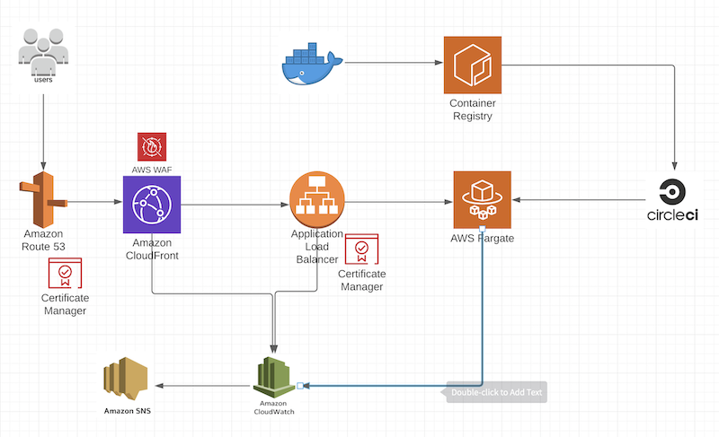
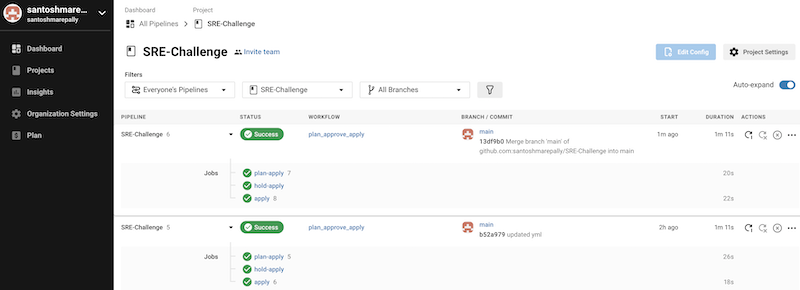
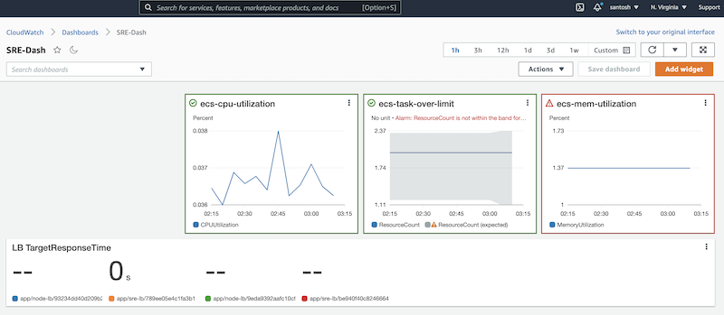

# Overview

Thank you for taking the extra time to complete this challenge.  The solution you provide will be used to help asses your ability to create a working solution based on a real-world use case.  We know your time is valuable, so please spend as much time as you think is appropriate (2-10 hours).

# Challenge

Welcome, you are the newest member of the DynamicEnablement team! You have been hand picked because of your ability to implement DevOps principles in a meaningful way and maximize value.

The DynamicEnablement team has created an app that will provide the answer to everything, but they are not sure how to deploy, scale, or even monitor.  As the SRE, they rely on you to guide them down this path and trust that you will make sure their product is "reliable".

The development team has provided their container for you, and now it is up to you to configure the rest.

As you design and deploy your solution, please make sure you keep these concepts in mind:
* Is everything automated? (IaC, CI/CD)
* Do I have security in place?
* How will this scale? (Cluster)
* How am I notified when a problem occurs?
* What is my reliability? (Monitoring and dashboard)
* How can I improve my reliability, or do I need to?

Ideally, the solution would be in GCP, however AWS would also be acceptable.

A complete solution should include:
* Infrastructure deployed using IaC
* Service deployed
* Automated deployment pipeline
* Monitoring
* SLI/SLO dashboard

&nbsp;
 
&nbsp;

==================================================================================

# Solution

- Infrastructure is developed using Terraform.
- Applicaiton is deployed on ECS Fargate, which will automatically scale between the set min and max capacity using the defined policy.
- Logging is enabled on ECS Task.
- CloudFront Distribution is created and WAF is enabled.
- CloudWatch Alarm are created for CPU, Memory, ECT Task limit, and LB Target response time. A Dashboard is created with these alerts.
- SNS Topic is set up to push notifications whenever and Alarm is triggered.

### Notes:
- Route53 is not implemented. This requires purchasing a domain.
- Certificates are not created as this requires a domain.
- For the purpose of testing port 80 is used, which can be changed to 443 for secure transfer (HTTPS).
- Load balancer Security group ingress is opened for all, which can be changed to certain IP for restricted access.

&nbsp;
 
&nbsp;

## Architecture:

&nbsp;
 
&nbsp;

## CICD:

&nbsp;
 
&nbsp;

## Dashboard:

